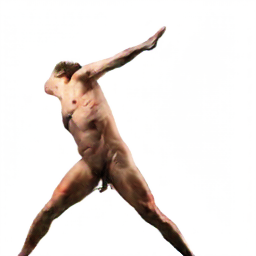

<!--
Template by Best-README-Template.
--->


[](./LICENSE.txt)


<p align="center">
  <h3 align="center">Susanna Humans 🤖</h3> 

  <p align="center">
    Trained on a huge set of anatomycal references,<br><strong>Susanna Humans</strong> is an Under-development Artistic Machine Learning project that uses <a href="https://github.com/junyanz/pytorch-CycleGAN-and-pix2pix">Pix2Pix CycleGAN source code</a> to colorize Humans Figures.
    <br />
    <a href="https://github.com/Eversmile12/susanna-client"><strong>Demo Client Repository »</strong></a>
    <br />
    <br />
    <a href="https://github.com/Eversmile12/susanna-server/issues">Report Bug</a>
    ·
    <a href="https://github.com/Eversmile12/susanna-server/issues">Request Feature</a>
  </p>
</p>


<!-- TABLE OF CONTENTS -->
<details open="open">
  <summary><h2 style="display: inline-block">Table of Contents</h2></summary>
  <ol>
    <li>
      <a href="#about-the-project">About The Project</a>
      <ul>
        <li><a href="#built-with">Built With</a></li>
      </ul>
    </li>
    <li>
      <a href="#getting-started">Getting Started</a>
      <ul>
        <li><a href="#prerequisites">Prerequisites</a></li>
        <li><a href="#installation">Installation</a></li>
      </ul>
    </li>
    <li><a href="#usage">Usage</a></li>
    <li><a href="#contributing">Contributing</a></li>
    <li><a href="#license">License</a></li>
    <li><a href="#contact">Contact</a></li>
    <li><a href="#acknowledgements">Acknowledgements</a></li>
  </ol>
</details>


<!-- ABOUT THE PROJECT -->
## ✏️ About The Project
<p>
  
  
  
  
</p>


The Susanna Project is an Under Development and OpenSource project created by **Vittorio Rivabella** and **Michele Vece**.

Susanna uses the [Pix2Pix algorithm and source code](https://github.com/junyanz/pytorch-CycleGAN-and-pix2pix) and has been trained on hundreds of high quality human anatomy images.

**Translate your lines into full painted drawings in a "snap".**

Using pix2pix BtoA conversion Susanna is capable of processing your drawings trying to recognize known "human-like shapes" and patterns, applying colors based on the given dataset.

This project is far from finished but we'd love to involve the community in shaping a better application, capable of empowering Concept Artists and the Digital-Art community.

**The project is completely OpenSource**


We're providing a local Python RESTful API, feel free to explore the currently implemented functionalities.

### ⚙️ Built With 

#### Server:
* [Python](https://www.python.org/)
* [Flask](https://flask.palletsprojects.com/en/1.1.x/)
* [Jupyter Notebook](https://jupyter.org/)
* Shell

#### Demo Client:
* [HTML](https://www.w3schools.com/html/)
* [CSS](https://www.w3schools.com/html/)
* [Javascript](https://www.w3schools.com/js/DEFAULT.asp)
* [JQuery](https://jquery.com/)

We aim to change our stack soon, feel free to suggest changes opening an [issue](https://github.com/Eversmile12/susanna-server/issues).


<!-- GETTING STARTED -->
##💻 Getting Started

To get a local copy up and running follow these simple steps.

### Prerequisites

The following instructions are for Windows Users only.

* Python 3.6+ and pip3
  * Check if you already have python3 and installed by running
    ```sh
    $ python3 --version
    ```
    ```sh
    $ pip3 --version
    ```

  * If *“Python is not recognized as an internal or external command”*, please install your copy from [Python.org](https://www.python.org/downloads/)
* Tested on Windows 10
* CPU or NVIDIA GPU + CUDA CuDNN


### Installation


1. Clone the repo.
   ```sh
    $ git clone https://github.com/Eversmile12/susanna-server.git
   ```
2. Open the project folder using the terminal and install pip3 virtual environment.
    ```sh
      $ pip3 install virtualenv
    ```
3. Create the virtual environment.
     ```sh
      $ virtualenv venv
    ```
4. Activate the virtual environment.
    ```sh
      $ venv\Scripts\activate
    ```
    You should now see (venv) before your terminal directory.
    

5. Install the required dependencies into the virtual environment.
     ```sh
        $ pip install -r requirements.txt
    ```
6. Set up virtual environment variables for Flask.
    ```sh
        $ set FLASK_APP=main.py
        $ set FLASK_ENV=development
    ```
7. Run Flask Server going into the "app" directory.
    ```sh
        $ flask run
    ```

*For more informations on how to run your Flask server pleaser refer to [Official Flask Documentation](https://flask.palletsprojects.com/en/1.1.x/installation/)*


<!-- USAGE EXAMPLES -->
## ✍️ Usage

1. Clone the Demo Client repo [here](https://github.com/Eversmile12/susanna-client).

2. Start the Python server as shown above.

3. Inside the Susanna-client folder, open index.html


  *For more informations about the Client refer to the [Client Documentation](https://github.com/Eversmile12/susanna-client)*


<!-- CONTRIBUTING -->
## 🙏 Contributing

Contributions are what make the open source community such an amazing place to be learn, inspire, and create. Any contributions you make are **greatly appreciated**.

1. Fork the Project
2. Create your Feature Branch (`git checkout -b feature/AmazingFeature`)
3. Commit your Changes (`git commit -m 'Add some AmazingFeature'`)
4. Push to the Branch (`git push origin feature/AmazingFeature`)
5. Open a Pull Request


<!-- LICENSE -->
## License

Distributed under the GNU GPL V3.0 License. See `LICENSE` for more information.


<!-- CONTACT -->
## Contact

Vittorio Rivabella - [@VittorioRivabella](https://www.linkedin.com/in/vittorio-rivabella/) - iwasvitto@gmail.com
<br />
Michele Vece - michelevece40@gmail.com 

Project Link: [https://github.com/Eversmile12/susanna-server](https://github.com/Eversmile12/susanna-server)


<!-- ACKNOWLEDGEMENTS -->
## Acknowledgements

* [Pix2Pix](https://github.com/junyanz/pytorch-CycleGAN-and-pix2pix)
* [Flask Documentation](https://flask.palletsprojects.com/en/1.1.x/)
* [University of Highlands and Islands](https://www.uhi.ac.uk/en/)
* [Fine Arts Accademy of Brera](https://www.accademiadibrera.milano.it/)


<!-- MARKDOWN LINKS & IMAGES -->
<!-- https://www.markdownguide.org/basic-syntax/#reference-style-links -->
[contributors-shield]: https://img.shields.io/github/contributors/Eversmile12/repo.svg?style=for-the-badge
[contributors-url]: https://github.com/Eversmile12/repo/graphs/contributors
[forks-shield]: https://img.shields.io/github/forks/Eversmile12/repo.svg?style=for-the-badge
[forks-url]: https://github.com/Eversmile12/repo/network/members
[stars-shield]: https://img.shields.io/github/stars/Eversmile12/repo.svg?style=for-the-badge
[stars-url]: https://github.com/Eversmile12/repo/stargazers
[issues-shield]: https://img.shields.io/github/issues/Eversmile12/repo.svg?style=for-the-badge
[issues-url]: https://github.com/Eversmile12/repo/issues
[license-shield]: https://img.shields.io/github/license/Eversmile12/repo.svg?style=for-the-badge
[license-url]: https://github.com/Eversmile12/repo/blob/master/LICENSE.txt
[linkedin-shield]: https://img.shields.io/badge/-LinkedIn-black.svg?style=for-the-badge&logo=linkedin&colorB=555
[linkedin-url]: https://linkedin.com/in/Eversmile12